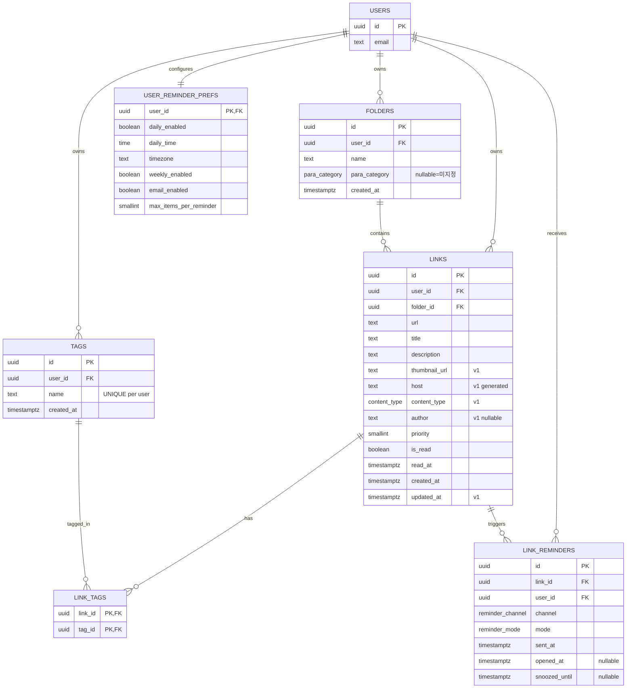

# ERD (Entity Relationship Diagram)

> save-it 서비스의 데이터 모델을 정의한다. PRD의 PARA 기반 분류와
> REMIND_STRATEGY의 리마인드 알고리즘이 동작하기 위해 필요한 엔터티,
> 관계, 그리고 단계별 도입 순서를 기록한다.
>
> 현재 마이그레이션: `web/supabase/migrations/00001_create_tables.sql`

---

## 1. 설계 원칙

1. **PARA는 폴더의 속성**으로 둔다 — 별도 테이블로 분리하지 않는다.
   PARA는 분류 체계가 아니라 "재노출 정책을 결정하는 기준"
   (REMIND_STRATEGY §2.1)이므로 `folders.para_category` enum으로 충분하다.
2. **컨텍스트 매칭(YouTube 모드)에 필요한 메타데이터는 `links`에 직접 둔다.**
   1:1 관계를 별도 테이블로 분리하면 조인 비용만 늘어난다.
3. **태그와 폴더는 의미가 다른 축**이다. 폴더 = 재노출 정책,
   태그 = 자유 검색/필터. 한 테이블로 묶지 않는다.
4. **리마인드 이력은 두 가지 역할을 한다** — 점수 계산의 피로도 입력이자
   KPI(재열람률) 측정의 원천. 둘 다 `link_reminders` 한 테이블로 처리한다.
5. **모든 사용자 데이터 테이블은 RLS 적용** — `auth.uid() = user_id` 패턴.

---

## 2. 엔터티 개요

| 분류 | 테이블 | 단계 | 비고 |
|------|--------|------|------|
| 인증 | `auth.users` | 기존 | Supabase Auth가 관리 |
| 핵심 | `folders` | MVP (현존) | PARA 카테고리 포함 |
| 핵심 | `links` | MVP (현존) | 메타데이터 컬럼 확장 예정 |
| 분류 | `tags` | v1 | PRD §5 권장 기능 |
| 분류 | `link_tags` | v1 | M:N 정션 |
| 리마인드 | `link_reminders` | v1 | 이력 + KPI |
| 리마인드 | `user_reminder_prefs` | v1 | 사용자별 설정 (1:1) |

---

## 3. ERD 다이어그램



---

## 4. 엔터티별 상세

### 4.1 `folders` (현존)

PARA 분류의 컨테이너. 사용자 가입 시 트리거로 "미지정"
(`para_category = null`) 폴더가 자동 생성된다.

| 컬럼 | 타입 | 설명 |
|------|------|------|
| `id` | uuid | PK |
| `user_id` | uuid | FK → auth.users (cascade) |
| `name` | text | 사용자 정의 폴더명 |
| `para_category` | enum | `project` / `area` / `resource` / `archive` / null |
| `created_at` | timestamptz | |

`para_category`가 null인 폴더는 REMIND_STRATEGY §2.1에서 Resources와 동일
정책으로 처리한다.

### 4.2 `links` (현존 + 확장 예정)

저장된 링크. v1에서 컨텍스트 매칭(REMIND §3.3)을 위한 컬럼이 추가된다.

| 컬럼 | 타입 | 단계 | 설명 |
|------|------|------|------|
| `id` | uuid | MVP | PK |
| `user_id` | uuid | MVP | FK |
| `folder_id` | uuid | MVP | FK → folders (cascade) |
| `url` | text | MVP | 원본 URL |
| `title` | text | MVP | |
| `description` | text | MVP | nullable |
| `priority` | smallint | MVP | 중요도 (0~) |
| `is_read` | boolean | MVP | 열람 여부 |
| `read_at` | timestamptz | MVP | 첫 열람 시각 |
| `created_at` | timestamptz | MVP | |
| `thumbnail_url` | text | v1 | YouTube 카드 등에 노출 |
| `host` | text generated | v1 | URL 호스트 추출, 함수 인덱스로 매칭 가속 |
| `content_type` | enum | v1 | `youtube` / `article` / `github` / `other` |
| `author` | text | v1 | 채널/저자 매칭용 (REMIND §3.3 일반화) |
| `updated_at` | timestamptz | v1 | 수정/이동 추적 (PRD §5 선택 기능) |

**MVP 보강 우선순위**: `host`(generated) + `content_type` + `thumbnail_url`
세 컬럼만 먼저 추가해도 YouTube 모드(REMIND §3.3 우선 케이스)가 동작한다.

### 4.3 `tags` / `link_tags` (v1)

PRD §5의 "태그 및 카테고리" 권장 기능. PARA와는 다른 자유 분류 축이다.

```sql
create table tags (
  id uuid primary key default gen_random_uuid(),
  user_id uuid not null references auth.users(id) on delete cascade,
  name text not null,
  created_at timestamptz not null default now()
);

create table link_tags (
  link_id uuid not null references links(id) on delete cascade,
  tag_id uuid not null references tags(id) on delete cascade,
  primary key (link_id, tag_id)
);

create unique index uq_tags_user_name on tags(user_id, lower(name));
create index idx_link_tags_tag on link_tags(tag_id);
```

태그 이름의 대소문자/공백 정규화 정책은 애플리케이션 레이어에서 결정한다.

### 4.4 `link_reminders` (v1)

REMIND_STRATEGY §6.1 그대로. **점수 계산의 피로도 입력**이자
**KPI 측정의 원천**이다.

```sql
create type reminder_channel as enum ('dashboard', 'extension', 'email', 'push');
create type reminder_mode as enum (
  'daily',         -- 일일 다이제스트
  'weekly',        -- 주간 회고
  'resurface',     -- 오래된 Resource 재발굴
  'priority',      -- 중요한데 놓친 것
  'youtube_ctx',   -- YouTube 컨텍스트 매칭
  'domain_ctx'     -- 일반 도메인 매칭
);

create table link_reminders (
  id uuid primary key default gen_random_uuid(),
  link_id uuid not null references links(id) on delete cascade,
  user_id uuid not null references auth.users(id) on delete cascade,
  channel reminder_channel not null,
  mode reminder_mode not null,
  sent_at timestamptz not null default now(),
  opened_at timestamptz,
  snoozed_until timestamptz
);
```

`channel` / `mode`는 enum으로 둔다. 텍스트로 두면 오타 한 번에 KPI 분리
집계가 망가진다.

### 4.5 `user_reminder_prefs` (v1)

REMIND_STRATEGY §6.2 그대로. PK를 `user_id`로 두면 1:1이 강제된다.

```sql
create table user_reminder_prefs (
  user_id uuid primary key references auth.users(id) on delete cascade,
  daily_enabled boolean not null default true,
  daily_time time not null default '09:00',
  timezone text not null default 'Asia/Seoul',
  weekly_enabled boolean not null default true,
  email_enabled boolean not null default false,
  max_items_per_reminder smallint not null default 5
);
```

신규 가입자에 대해 기본 행을 자동 생성하는 트리거를 두면 NULL 체크가
필요 없어진다 (`folders` 기본 폴더 트리거와 동일 패턴).

---

## 5. 인덱스 전략

```sql
-- 컨텍스트 매칭 (REMIND §3.3)
create index idx_links_user_host on links(user_id, host);
create index idx_links_content_type on links(user_id, content_type);

-- "오늘 다시 볼 링크" 점수 후보 쿼리 (MVP)
create index idx_links_unread_priority
  on links(user_id, is_read, priority desc, created_at);

-- 리마인드 이력 조회 / 피로도 계산
create index idx_link_reminders_link_sent on link_reminders(link_id, sent_at desc);
create index idx_link_reminders_user_sent on link_reminders(user_id, sent_at desc);

-- 태그 검색
create index idx_link_tags_tag on link_tags(tag_id);
create unique index uq_tags_user_name on tags(user_id, lower(name));
```

`host`는 `generated always as (...) stored`로 두고 위 함수 인덱스를
얹는다. 매번 URL 파싱을 하지 않아도 되어 컨텍스트 매칭 쿼리가 가벼워진다.

---

## 6. RLS 정책

모든 신규 테이블에 기존 `links` / `folders`와 동일한 패턴 적용.

```sql
alter table tags enable row level security;
alter table link_tags enable row level security;
alter table link_reminders enable row level security;
alter table user_reminder_prefs enable row level security;

-- tags: user_id 기준
-- link_tags: 소속 link의 user_id 기준 (서브쿼리)
-- link_reminders: user_id 기준
-- user_reminder_prefs: user_id 기준
```

`link_tags`는 자체 컬럼에 `user_id`가 없으므로, 정책 작성 시 다음 중 하나를
선택한다.

1. **서브쿼리 방식** — `exists (select 1 from links where links.id = link_id and links.user_id = auth.uid())`
2. **`user_id` 컬럼 추가 + 트리거 동기화** — 인덱스/조회는 빨라지지만 일관성
   유지 비용이 든다.

MVP/v1 트래픽 규모에서는 서브쿼리 방식으로 충분하다.

---

## 7. 단계별 도입 순서

| 단계 | 마이그레이션 | 추가 항목 |
|------|---------------|-----------|
| **MVP** | `00001_create_tables.sql` | `folders`, `links`, RLS, 기본 폴더 트리거 (현존) |
| **MVP 보강** | `00002_link_metadata.sql` | `links.host` (generated) / `content_type` / `thumbnail_url` — YouTube 모드 동작에 필요한 최소 컬럼 |
| **v1-a** | `00003_tags.sql` | `tags`, `link_tags`, RLS, 인덱스 |
| **v1-b** | `00004_reminders.sql` | enum 2종, `link_reminders`, `user_reminder_prefs`, 기본 prefs 트리거 |
| **v2** | (스키마 변경 없음) | `link_reminders` 누적 데이터로 점수 가중치 자동 튜닝 |

각 마이그레이션은 가능하면 한 파일에 하나의 관심사만 담는다. 롤백/리뷰가
쉽다.

---

## 8. 열린 질문

REMIND_STRATEGY §10과 별개로, 데이터 모델 차원에서 결정이 미뤄진 항목.

- **`content_type` 분류 시점** — 저장 시점에 결정할지, 비동기로 추론할지.
  저장 시점이면 익스텐션/웹앱 양쪽에 분류 로직이 들어가고, 비동기면
  `content_type`이 nullable이어야 한다.
- **`tags` 정규화** — 대소문자, 공백, 한/영 혼용을 어디까지 같은 태그로
  볼 것인지. unique index의 `lower(name)`만으로 충분한지.
- **`link_reminders` 보존 기간** — 1년 이상 누적되면 점수 계산 쿼리가
  무거워진다. 일정 시점 이후 집계 테이블로 롤업할지 결정 필요.
- **소프트 삭제** — 현재 모든 FK가 `on delete cascade`. 사용자가
  실수로 폴더를 지우면 링크까지 사라진다. 휴지통(soft delete) 도입 여부.
